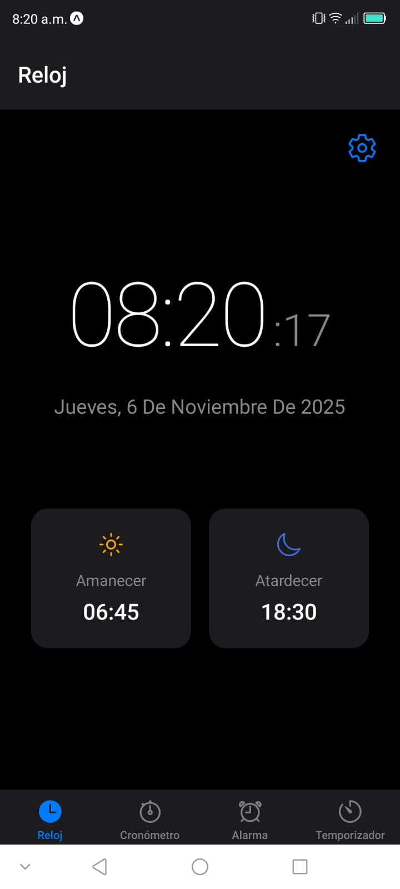
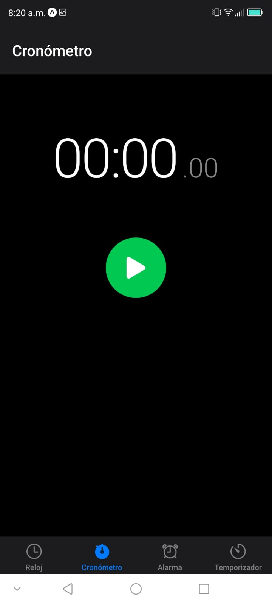
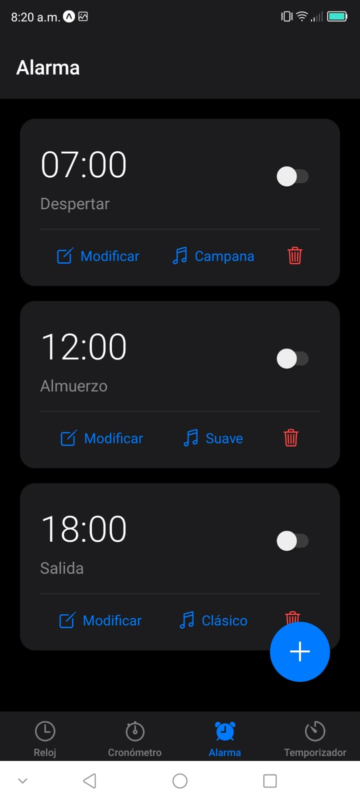
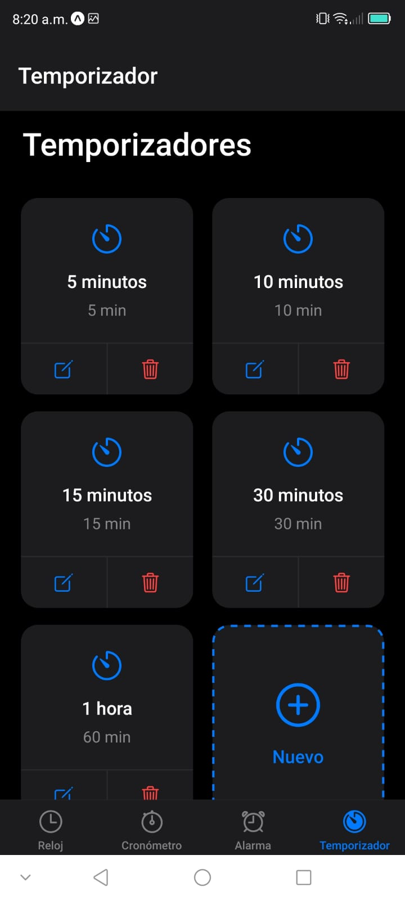

# Clock App - Aplicación de Reloj para Móvil

## 1. Identificación del Proyecto

- **Nombre de la App:** Clock App
- **Asignatura/Profesor:** Desarrollo de Aplicaciones Móviles / [Tu Profesor]
- **Periodo/Fecha:** Noviembre 2025
- **URL del Repositorio:** https://github.com/Alex2004d/clockApp.git

## 2. Descripción del Proyecto

Clock App es una aplicación móvil completa desarrollada con React Native y Expo que proporciona funcionalidades esenciales de reloj para dispositivos móviles. La aplicación cuenta con una interfaz moderna con tema oscuro y navegación fluida entre cuatro pantallas principales.

### Características Principales:
- 🕐 **Reloj Principal**: Visualización de hora en tiempo real con formato 12/24 horas
- ⏱️ **Cronómetro**: Medición precisa de tiempo con sistema de vueltas
- ⏰ **Alarmas**: Gestión completa de alarmas con múltiples tonos
- ⏲️ **Temporizador**: Temporizadores predefinidos y personalizados

### Funcionalidades Implementadas:
- Sistema de navegación por pestañas (Tab Navigation)
- Actualización de tiempo en tiempo real
- Gestión de estado con React Hooks
- Modales para edición y configuración
- Persistencia de datos en memoria
- Diseño responsivo y optimizado para móviles
- Estructura de código modular y escalable

## 3. Tecnologías y Versiones Utilizadas

### Stack Tecnológico:
- **React Native:** 0.76.5
- **React:** 18.3.1
- **Expo:** ~54.0.6
- **React Navigation:** ^6.1.9 (Bottom Tabs ^6.5.11)
- **React Native Screens:** ~4.3.0
- **React Native Safe Area Context:** ~4.12.0
- **Expo AV:** ~15.0.1

### Herramientas de Desarrollo Requeridas:

- **Node.js:** v18.17.0 o superior
  ```bash
  node --version
  ```
- **NPM:** 9.0.0+ o Yarn v1.22.19+
  ```bash
  npm --version
  ```
- **Expo CLI:** v6.3.0+
  ```bash
  npx expo --version
  ```
- **Expo Go:** v54.0.6 en dispositivo físico
  ```bash
  # Descargar desde Play Store o App Store
  ```

### Verificación de Entorno:
```bash
npx expo doctor
```

## 4. Estructura del Proyecto

### Organización de Archivos:
```
ClockApp/
├── App.js                          # Componente principal de la aplicación
├── app.json                        # Configuración de Expo
├── package.json                    # Dependencias y scripts
├── assets/                         # Recursos estáticos
│   ├── adaptive-icon.png
│   ├── favicon.png
│   ├── icon.png
│   └── splash.png
└── src/
    ├── api/                        # Lógica de negocio y utilidades
    │   └── clockAPI.js            # API con funciones del reloj
    ├── navigation/                 # Configuración de navegación
    │   └── TabNavigator.js        # Navegación por pestañas
    ├── screens/                    # Pantallas de la aplicación
    │   ├── ClockScreen.js         # Pantalla de reloj principal
    │   ├── StopwatchScreen.js     # Pantalla de cronómetro
    │   ├── AlarmScreen.js         # Pantalla de alarmas
    │   └── TimerScreen.js         # Pantalla de temporizador
    └── components/                 # Componentes reutilizables (opcional)
```

### Arquitectura de la Aplicación:
- **App.js**: Componente raíz con NavigationContainer
- **TabNavigator.js**: Configuración del Bottom Tab Navigator
- **clockAPI.js**: Funciones auxiliares para manejo de tiempo y datos
- **Screens**: Pantallas independientes para cada funcionalidad
- **React Hooks**: useState, useEffect, useRef para manejo de estado

## 5. Instalación y Configuración

### Instalación de Dependencias:
```bash
# Clonar el repositorio
git clone [tu-repositorio]
cd ClockApp

# Instalar dependencias
npm install
```

### Dependencias del Proyecto:

| Dependencia | Versión | Propósito |
|-------------|---------|-----------|
| `@react-navigation/native` | ^6.1.9 | Core de navegación entre pantallas |
| `@react-navigation/bottom-tabs` | ^6.5.11 | Tab navigator para navegación por pestañas |
| `react-native-screens` | ~4.3.0 | Optimización de rendimiento para transiciones |
| `react-native-safe-area-context` | ~4.12.0 | Manejo de áreas seguras (notch, barras) |
| `expo-av` | ~15.0.1 | Reproducción de audio para alarmas |
| `expo-status-bar` | ~2.0.0 | Control de barra de estado |
| `expo` | ~54.0.6 | Framework de desarrollo móvil |
| `react` | 18.3.1 | Biblioteca de interfaz de usuario |
| `react-native` | 0.76.5 | Framework móvil multiplataforma |

### Verificar instalación:
```bash
npm list --depth=0
```

## 6. Ejecución de la Aplicación

### Scripts Disponibles:
```bash
# Iniciar servidor de desarrollo
npm start
# o
npx expo start

# Ejecutar en Android (emulador/dispositivo)
npx expo start --android

# Ejecutar en iOS (solo macOS)
npx expo start --ios

# Limpiar caché
npx expo start --clear
```

### Primera Ejecución:
1. **Instalar dependencias:**
   ```bash
   npm install
   ```

2. **Iniciar el servidor de desarrollo:**
   ```bash
   npm start
   ```

3. **Conectar dispositivo:**
   - **Android/iOS:** Usar Expo Go (v54.0.6) y escanear QR code
   - **Emulador:** Presionar 'a' para Android o 'i' para iOS

### Notas de Entorno:
- **Expo Go:** Debe ser versión 54.0.6 para compatibilidad
- **Dispositivo físico:** Asegúrate de estar en la misma red WiFi
- **Túnel para redes restrictivas:** `npx expo start --tunnel`

## 7. Funcionalidades de la Aplicación

### Pantalla Principal - Reloj (ClockScreen):
- **Visualización en Tiempo Real**: Actualización automática cada segundo
- **Formato Configurable**: Cambio entre formato 12 y 24 horas
- **Información Adicional**: 
  - Fecha completa en español
  - Hora de amanecer y atardecer
- **Botón de Configuración**: Acceso rápido a ajustes
- **Diseño**: Números grandes y legibles con tema oscuro



### Pantalla de Cronómetro (StopwatchScreen):
- **Medición Precisa**: Precisión de centésimas de segundo
- **Controles**:
  - Botón **Iniciar**: Comienza la medición
  - Botón **Pausar**: Detiene temporalmente
  - Botón **Regresar**: Reinicia a 00:00.00
  - Botón **Vuelta**: Registra tiempos parciales
- **Sistema de Vueltas**: Lista de tiempos registrados
- **Interfaz**: Display digital grande con controles circulares



### Pantalla de Alarmas (AlarmScreen):
- **Gestión Completa de Alarmas**:
  - Activación/desactivación con switch
  - Modificar hora y etiqueta
  - Cambiar tono de alarma (5 opciones)
  - Eliminar alarmas con confirmación
- **Alarmas Predefinidas**:
  - 07:00 - Despertar (Campana)
  - 12:00 - Almuerzo (Suave)
  - 18:00 - Salida (Clásico)
- **Botón Agregar**: Crear nuevas alarmas personalizadas
- **Tonos Disponibles**: Campana, Suave, Clásico, Digital, Melodía



### Pantalla de Temporizador (TimerScreen):
- **Temporizadores Predefinidos**:
  - 5 minutos, 10 minutos, 15 minutos
  - 30 minutos, 1 hora
- **Controles del Temporizador Activo**:
  - Botón **Iniciar**: Comienza la cuenta regresiva
  - Botón **Pausar**: Detiene temporalmente
  - Botón **Regresar**: Vuelve a la lista de temporizadores
- **Gestión de Temporizadores**:
  - Botón **Editar**: Modificar nombre y duración
  - Botón **Eliminar**: Borrar temporizador con confirmación
  - Botón **Nuevo**: Crear temporizadores personalizados
- **Notificación**: Alerta al completarse el tiempo



### Navegación por Pestañas:
- **4 Pestañas Principales**: Acceso rápido a todas las funciones
- **Iconos Intuitivos**: Representación visual de cada sección
- **Indicador Visual**: Resalta la pestaña activa
- **Tema Oscuro**: Barra de navegación con fondo oscuro

### Características Técnicas:
- **Navegación Bottom Tabs**: Transiciones suaves entre pantallas
- **Diseño Responsivo**: Optimizado para diferentes tamaños
- **Tema Oscuro Completo**: Interfaz moderna y cómoda
- **Componentes Modulares**: Código organizado y mantenible
- **Gestión de Estado**: React Hooks (useState, useEffect, useRef)
- **Modales Interactivos**: Edición y configuración intuitiva

## 8. Desarrollo y Extensión

### Próximas Funcionalidades Sugeridas:
- **Persistencia de Datos**: Integrar AsyncStorage para guardar alarmas y temporizadores
- **Notificaciones Push**: Alertas reales cuando suenen alarmas
- **Widget**: Vista rápida del reloj en pantalla de inicio
- **Temas Personalizables**: Modo claro/oscuro y colores personalizados
- **Zonas Horarias**: Soporte para múltiples husos horarios
- **Estadísticas**: Histórico de uso del cronómetro
- **Sincronización**: Backup en la nube de configuraciones
- **Sonidos Personalizados**: Permitir usar música del dispositivo

### Estructura para Nuevas Pantallas:
```javascript
// Ejemplo de nueva pantalla
import React, { useState } from 'react';
import { View, Text, StyleSheet } from 'react-native';

export default function NewScreen() {
  const [state, setState] = useState(initialValue);
  
  return (
    <View style={styles.container}>
      <Text style={styles.title}>Nueva Pantalla</Text>
      {/* Contenido de la pantalla */}
    </View>
  );
}

const styles = StyleSheet.create({
  container: {
    flex: 1,
    backgroundColor: '#000',
    padding: 20,
  },
  title: {
    fontSize: 24,
    color: '#fff',
    fontWeight: '600',
  },
});
```

### Agregar Nuevas Rutas:
1. Crear componente en `src/screens/`
2. Importar en `src/navigation/TabNavigator.js`
3. Agregar `<Tab.Screen>` con configuración
4. Definir icono y nombre en `screenOptions`

### Extender clockAPI.js:
```javascript
// Agregar nuevas funciones auxiliares
export const clockAPI = {
  // ... funciones existentes
  
  // Nueva función
  convertToTimezone: (time, timezone) => {
    // Implementación
  },
};
```

## 9. Troubleshooting

### Problemas Comunes:
| Problema | Solución |
|----------|----------|
| **Error de instalación** | `npm install --legacy-peer-deps` |
| **Metro cache corrupto** | `npx expo start --clear` |
| **Puerto ocupado** | `npx expo start --port 8082` |
| **Versión de Expo Go incorrecta** | Actualizar a v54.0.6 desde la tienda |
| **No se ve en dispositivo** | Verificar misma red WiFi o usar `--tunnel` |
| **Dependencias desactualizadas** | `npx expo doctor` para diagnosticar |

### Comandos Útiles:
```bash
# Verificar entorno
npx expo doctor

# Limpiar caché completo
npx expo start --clear

# Reinstalar dependencias
rm -rf node_modules package-lock.json && npm install

# Ver logs detallados
npx expo start --verbose

# Usar túnel (redes restrictivas)
npx expo start --tunnel
```

### Errores de Navegación:
```bash
# Si hay problemas con react-navigation
npm install @react-navigation/native @react-navigation/bottom-tabs
npx expo install react-native-screens react-native-safe-area-context
```

### Problemas con Expo Go:
- Asegúrate de tener la versión **54.0.6**
- Cierra y vuelve a abrir la app
- Escanea nuevamente el QR code
- Verifica la conexión de red

## 10. Recursos y Documentación

### Documentación Oficial:
- [Expo Documentation](https://docs.expo.dev/)
- [React Navigation](https://reactnavigation.org/)
- [React Native Docs](https://reactnative.dev/)
- [React Hooks](https://react.dev/reference/react)

### Tutoriales y Guías:
- [Expo Bottom Tabs](https://reactnavigation.org/docs/bottom-tab-navigator/)
- [React Native AsyncStorage](https://react-native-async-storage.github.io/async-storage/)
- [Expo AV (Audio)](https://docs.expo.dev/versions/latest/sdk/av/)

### Componentes Utilizados:
- [View](https://reactnative.dev/docs/view)
- [Text](https://reactnative.dev/docs/text)
- [TouchableOpacity](https://reactnative.dev/docs/touchableopacity)
- [ScrollView](https://reactnative.dev/docs/scrollview)
- [Switch](https://reactnative.dev/docs/switch)
- [Modal](https://reactnative.dev/docs/modal)
- [TextInput](https://reactnative.dev/docs/textinput)

### Comunidad:
- [Expo Forums](https://forums.expo.dev/)
- [React Native Community](https://reactnative.dev/community/overview)
- [Stack Overflow - React Native](https://stackoverflow.com/questions/tagged/react-native)

---

## 11. Capturas de Pantalla

### Galería de Pantallas

#### Reloj Principal
Pantalla principal con hora en tiempo real, fecha completa y información de amanecer/atardecer.


#### Temporizador
Lista de temporizadores predefinidos y opción para crear personalizados.


#### Alarmas
Gestión completa de alarmas con opciones de modificación, cambio de tono y eliminación.


#### Cronómetro
Cronómetro con precisión de centésimas y sistema de registro de vueltas.


---

## 12. Créditos y Licencia

**Desarrollado por:** JUAN ALEJANDRO MOLINA DAMIAN  
**Última actualización:** 6 de noviembre 2025  
**Versión:** 1.0.0

### Licencia
Este proyecto fue desarrollado con fines educativos para la asignatura de Desarrollo de Aplicaciones Móviles.

### Agradecimientos
- Iconos proporcionados por [Ionicons](https://ionic.io/ionicons)
- Framework Expo por facilitar el desarrollo móvil
- Comunidad de React Native por documentación y soporte

---

**Nota:** Esta aplicación fue creada como proyecto educativo utilizando React Native, Expo y JavaScript. Todas las funcionalidades son completamente funcionales y el código está optimizado para ser ejecutado con Expo Go versión 54.0.6.